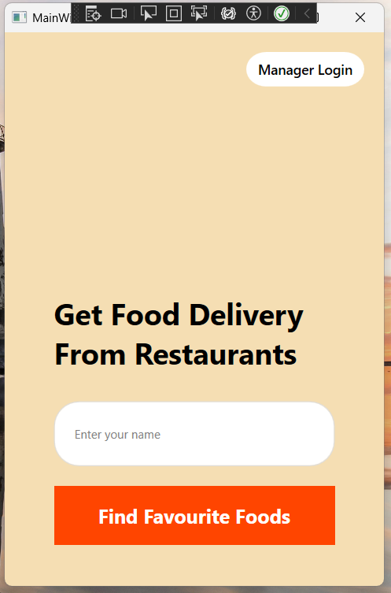
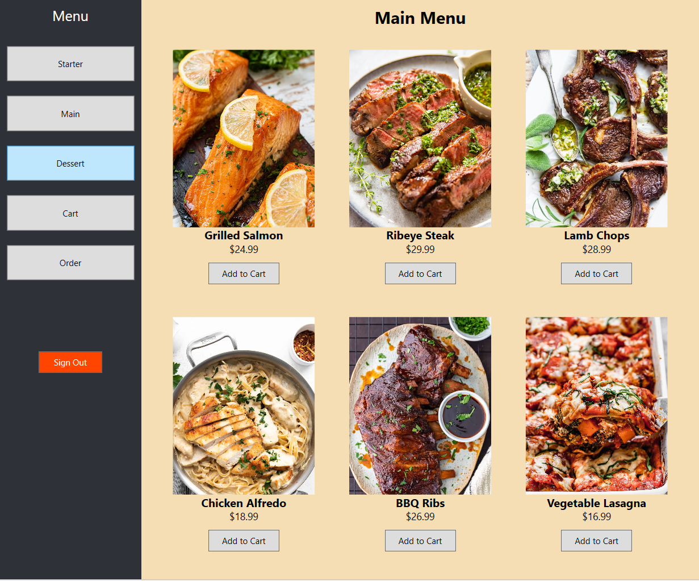
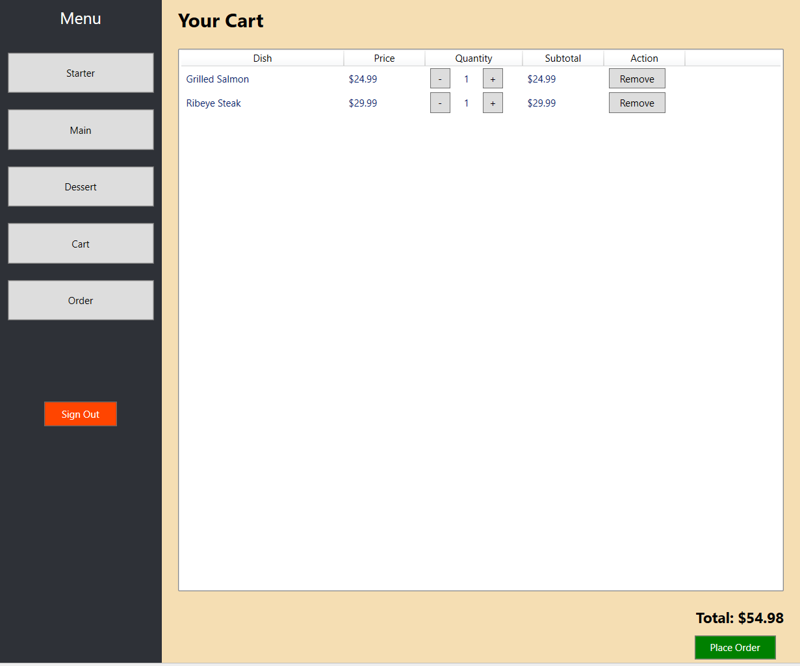
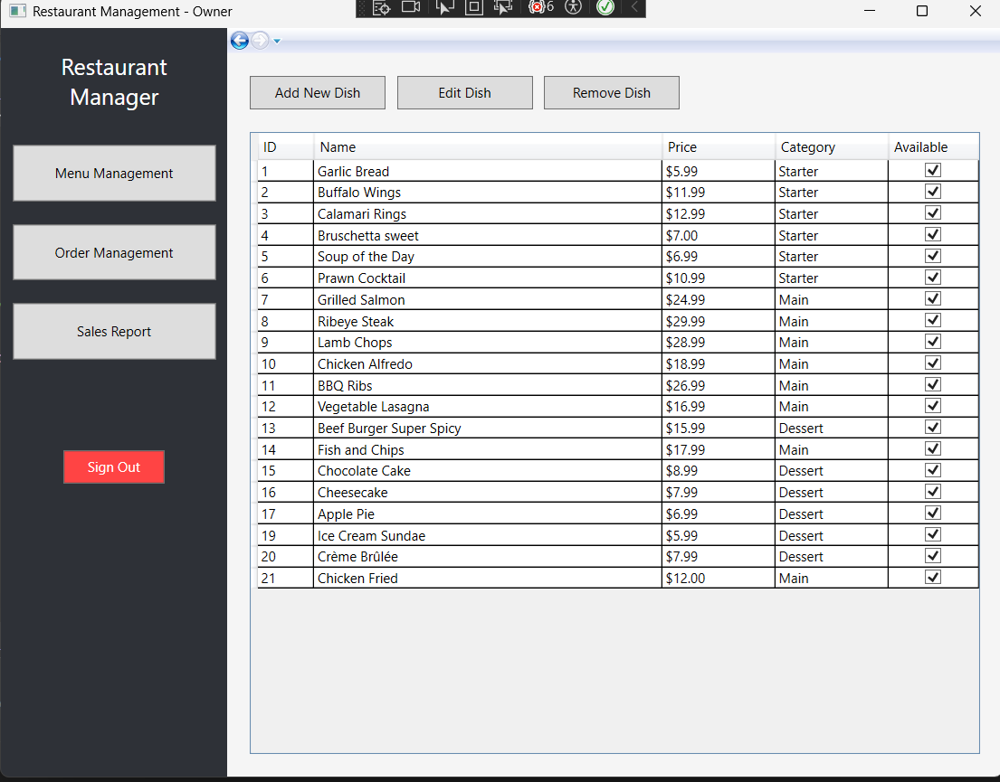
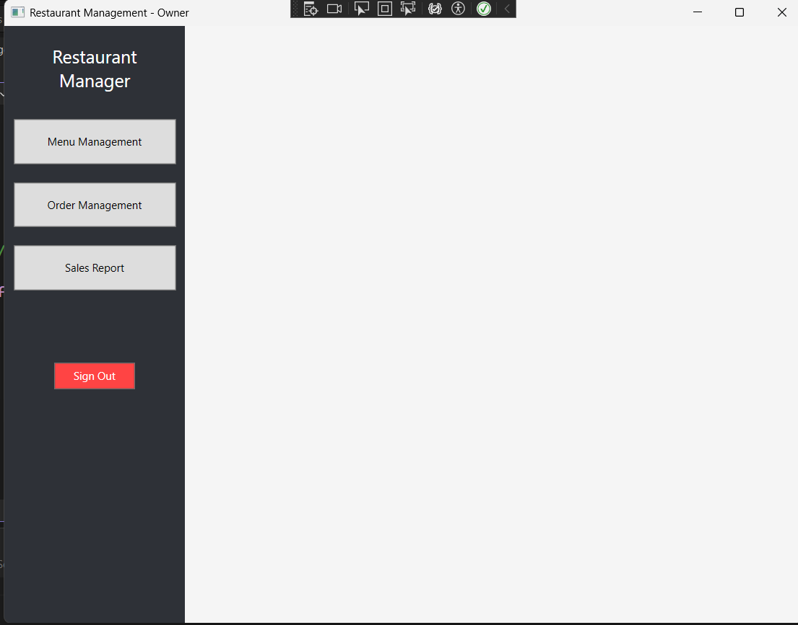
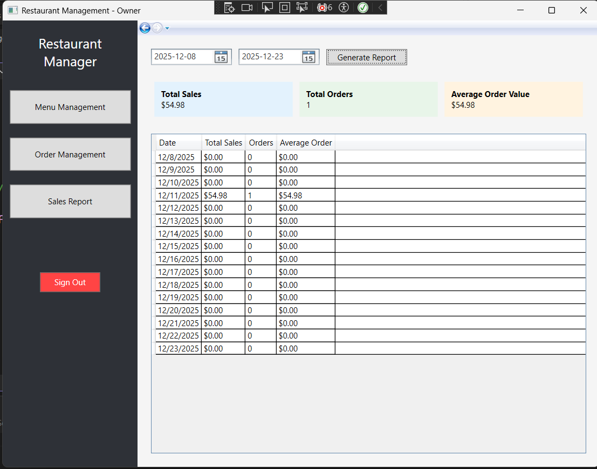

# 🍽️ Restaurant Management System

A modern, full-featured Windows desktop application built with WPF and .NET 8 for managing restaurant operations efficiently. This application provides a dual-interface system catering to both restaurant owners and customers, streamlining menu management, order processing, and sales tracking.

## 📋 Overview
The Restaurant Management System is a comprehensive solution designed to digitize and simplify restaurant operations. Built using Windows Presentation Foundation (WPF), it offers an intuitive graphical interface that separates concerns between administrative tasks and customer ordering experiences.
## 📷 App Screenshots
Below are screenshots from the application (files located in PIII_Project_RestaurantApp/AppScreenshots/):

### Welcome Page

### Menu Page

### Cart Page

### Order History

### Admin / Owner Dashboard

### Admin Dashboard

### Generate Report (by date)

## ✨ Key Features
### 👨‍💼 Owner Features
- Authentication System: Secure login for restaurant owners to access administrative functions
- Menu Management: Add, edit, and delete menu items; Organize dishes by categories (Starters, Main Courses, Desserts); Update pricing and availability status; Upload and manage dish images
- Order Management: View all customer orders in real-time; Update order statuses (Pending, Preparing, Completed); Track order details and order items
- Sales Reporting: Generate daily sales reports; Track revenue and order statistics; Analyze business performance metrics
### 👥 Customer Features
- User-Friendly Ordering Interface:
- Browse menu by categories (Starters, Main Courses, Desserts)
- View high-quality dish images and descriptions
- Check prices and availability
- Shopping Cart System:
- Add/remove items from cart
- Adjust quantities
- View total cost before checkout
- Order Placement: Place orders with customer name; Receive order confirmations;
- Order History:View past orders; Track order status; Review order details and totals
### 🛠️ Technology Stack
- Framework: .NET 8.0 (Windows)
- UI Framework: WPF (Windows Presentation Foundation)
- Language: C#
- Data Storage: CSV files for persistent data storage
- Architecture: MVVM-inspired pattern with separation of concerns
### Usage
**For Customers** 
1.	Enter your name on the welcome screen
2.	Click "Customer" to access the ordering interface
3.	Browse menu categories and add items to your cart
4.	Review your cart and place your order

**For Owners**
Account: *cmders@restaurant.com/cmders999*
1.	Click "Owner" on the welcome screen
2.	Authenticate with owner credentials
3.	Access menu management, order tracking, and sales reports
### 📊 Data Management
The application uses CSV files for data persistence:
- dishes.csv: Stores menu items with categories, prices, and availability
- orders.csv: Tracks customer orders with status and totals
- order_items.csv: Maintains order line items and quantities
### 🎨 Features Highlights
- Rich Visual Experience: High-quality images for all menu items
- Real-time Updates: Synchronization between menu management and customer views
- Role-based Access: Separate interfaces for owners and customers
- Order Tracking: Complete lifecycle management from order placement to completion
- Flexible Menu: Support for multiple dish categories with easy categorization

📝 License
This project is for educational purposes as part of the PIII course project at John Abbott College
👨‍💻 Team
Cuong Ngo
## Development Team
- [Cuong Ngo](https://github.com/cuongngodev)
- [Linyue](https://github.com/Linyue-dev) 
